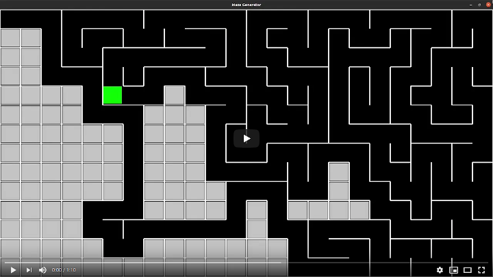

# Maze Generator

Maze generation algorithms are automated methods for the creation of mazes.

## Randomized depth-first search

This algorithm, also known as the "recursive backtracker" algorithm, is a randomized version of the depth-first search algorithm.

Frequently implemented with a stack, this approach is one of the simplest ways to generate a maze using a computer. Consider the space for a maze being a large grid of cells (like a large chessboard), each cell starting with four walls. Starting from a random cell, the computer then selects a random neighboring cell that has not yet been visited. The computer removes the wall between the two cells and marks the new cell as visited, and adds it to the stack to facilitate backtracking. The computer continues this process, with a cell that has no unvisited neighbors being considered a dead-end. When at a dead-end it backtracks through the path until it reaches a cell with an unvisited neighbor, continuing the path generation by visiting this new, unvisited cell (creating a new junction). This process continues until every cell has been visited, causing the computer to backtrack all the way back to the beginning cell. We can be sure every cell is visited.

As given above this algorithm involves deep recursion which may cause stack overflow issues on some computer architectures. The algorithm can be rearranged into a loop by storing backtracking information in the maze itself. This also provides a quick way to display a solution, by starting at any given point and backtracking to the beginning.

Mazes generated with a depth-first search have a low branching factor and contain many long hallways because the algorithm explores as far as possible along each branch before backtracking.

## Iterative implementation

The backtracking method can be implemented with an explicit stack, which is usually allowed to grow much bigger with no harm.

    1. Choose the initial cell, mark it as visited, and push it to the stack
    2. While the stack is not empty
        1. Pop a cell from the stack and make it a current cell
        2. If the current cell has any neighbors which have not been visited
            1. Push the current cell to the stack
            2. Choose one of the unvisited neighbors
            3. Remove the wall between the current cell and the chosen cell
            4. Mark the chosen cell as visited and push it to the stack
